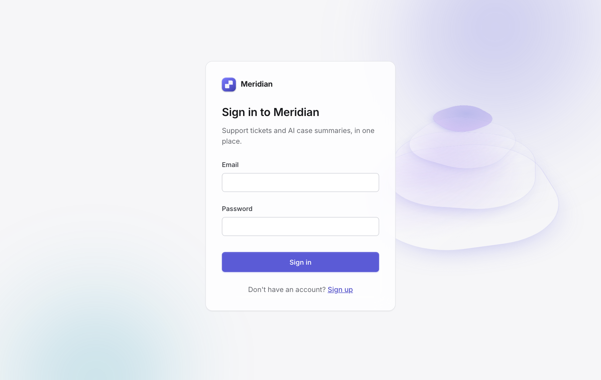
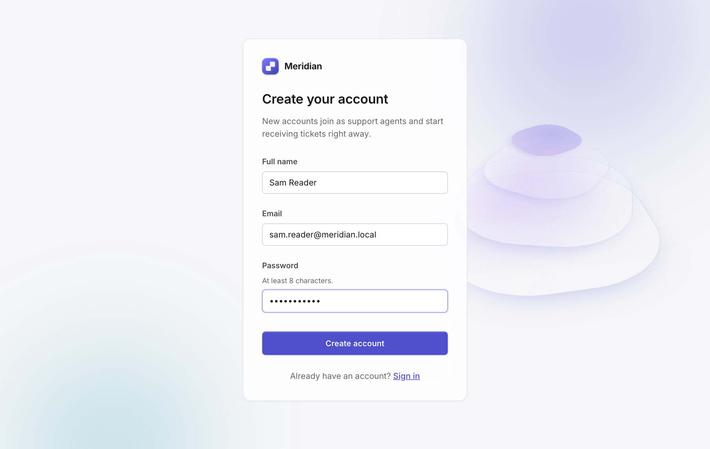
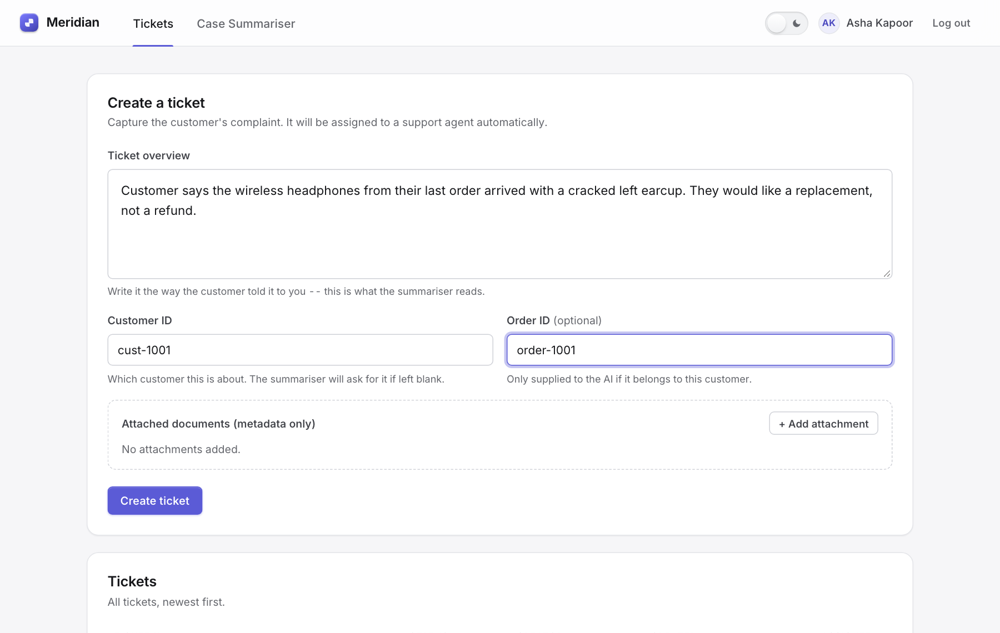
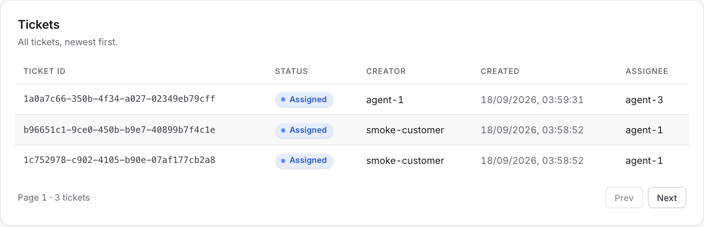
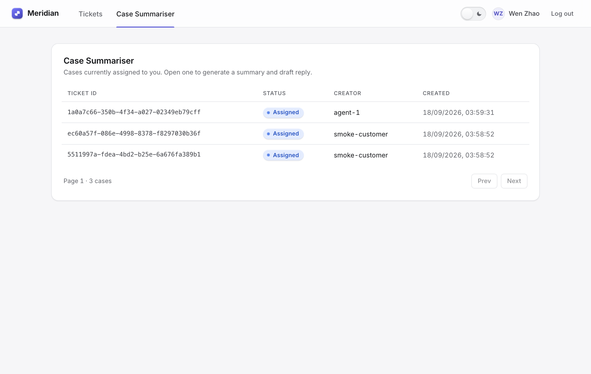
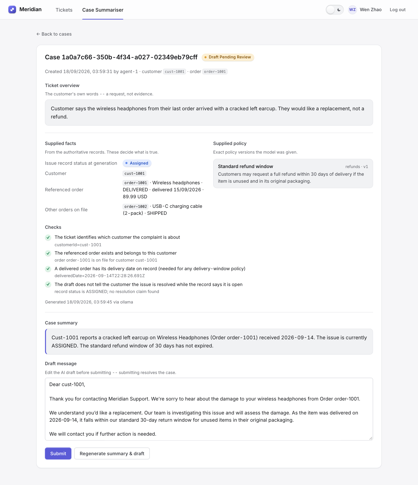
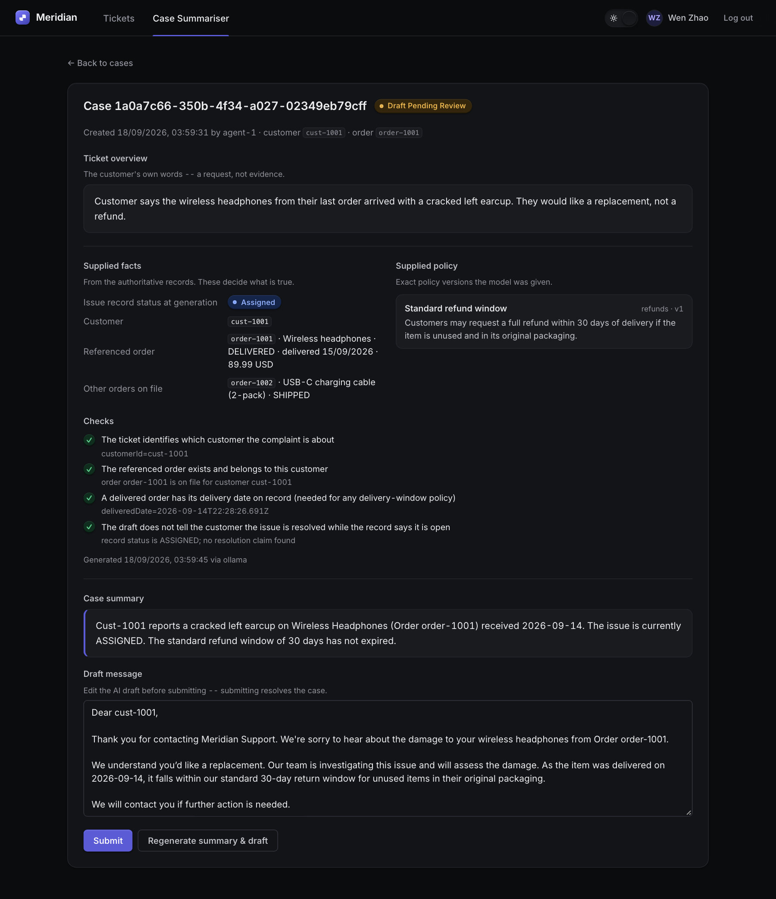
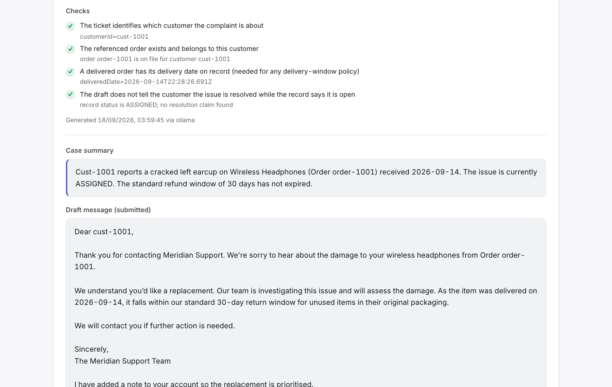
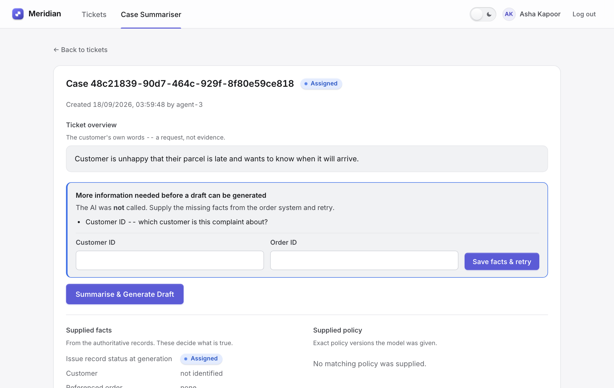

# Meridian

**Meridian helps a support team answer customer complaints faster, with an
AI assistant that is only allowed to say what the records back up.**

A support rep types in what the customer said. Meridian hands the ticket to
an agent automatically, and when that agent is ready, writes a first draft
of the reply for them — after checking the order system for the facts. The
agent reads the evidence, edits the draft, and sends it. **A person always
makes the final call.**

It runs on a laptop with no internet, no cloud account and no paid AI
service (a free local model does the writing). The ten-minute set-up is in
[docs/RUNBOOK.md](docs/RUNBOOK.md).

---

## What it looks like

### 1. Sign in, or create your own agent account

New accounts start receiving tickets straight away.

<p>


</p>

### 2. Log a complaint — it is assigned to an agent for you

Write it the way the customer told it to you. Add the customer and order
number if you have them; if you don't, Meridian will ask for them later.



The moment you press **Create ticket**, it is handed to the next available
agent (round-robin, so work is shared evenly):



### 3. The agent opens their queue and asks for a draft

Each agent sees only the cases assigned to them.



One click. A small animation shows the AI is working; with the free local
model this takes about 10–40 seconds on a laptop.


### 4. Meridian shows its evidence, then its draft

This is the important screen. Before the draft you see exactly what the AI
was given — the **facts from the order system**, the **policy** it was
allowed to cite, and a list of **checks** that ran. Everything in the draft
can be traced back to one of those lines.



<details>
<summary>Same screen in dark mode (one click in the top bar)</summary>


</details>

### 5. The agent edits and sends — the ticket is resolved



### What happens when the facts are missing?

The AI is **not asked**. Meridian tells the agent what is missing, lets
them fill it in right there, and retries. It never guesses which customer
or which order a complaint is about.



---

## How Meridian keeps the AI honest

Most "AI writes the reply" tools let the model read the complaint and
improvise. Meridian does four things differently, and you can see all of
them on the screens above:

| Rule | What it means for a customer |
|---|---|
| **Facts come from the records, not the complaint** | If the customer says "my order was delivered on the 3rd" but the system says the 5th, the draft says the 5th. |
| **No facts, no AI** | If the ticket doesn't identify the customer or the order, the model isn't called at all. The agent is asked first. |
| **Only the customer's own orders** | The AI is never shown another customer's data, even if an order number was typed in by mistake. |
| **It can't declare victory** | A draft that tells the customer "this is now resolved" while the ticket is still open is thrown away, not shown. |

And two things that keep the cost predictable:

* By default the writing is done by a **free model running on your own
  machine** (Ollama). Paid services (Claude, OpenAI) are a one-line switch.
* Any ticket containing the word **test** skips the AI entirely and returns
  a fixed answer — so demos, training sessions and automated tests never
  spend real money.

## Try it

Everything you need — installing, the demo script, the test accounts,
switching AI providers, and a troubleshooting table — is in
**[docs/RUNBOOK.md](docs/RUNBOOK.md)**. It is written for developers and
non-developers alike.

Test account to start with: `asha.kapoor@meridian.local` / `AgentDemo!123`.

## Status

| Part | State |
|---|---|
| Ticketing, assignment, sign-in/sign-up, AI drafting with checks, dark/light theme | **Working**, verified end to end on a real database and a real local model |
| Automated checks | Lint, type-check, ~240 tests with a 90% coverage gate, a live smoke test — all run on every change in GitHub Actions |
| Cloud deployment (AWS) | Written and linted, **not deployed** (no cloud account is needed for anything above) |

---

## Appendix — for programmers

### Layout
```
frontend/               React + TypeScript (Vite) SPA
backend/                Express + TypeScript API — DI via tsyringe, builder pattern, config resolver
packages/shared-types/  Types shared by frontend, backend and the Lambda scaffold
infra/                  CloudFormation/SAM template, Lambda handler stubs, alarms + dashboard (code-only)
docs/                   RUNBOOK.md, images/, aws-cost-notes.md, dated test reports
docker-compose.yml      Offline stack: Postgres (+ optional Ollama container)
.github/workflows/      CI: lint, typecheck, test + coverage, build + smoke, cfn-lint
```

### Commands (repo root)
```bash
npm install                          # once (npm workspaces)
cp .env.example .env                 # defaults work; add API keys only if you switch provider
docker compose up -d postgres        # or any local Postgres via DATABASE_URL
npm run build                        # shared-types -> backend -> frontend, in dependency order
npm run migrate --workspace=backend  # idempotent
npm run seed --workspace=backend     # demo users/policies/orders (prints the passwords once)
npm run dev:backend                  # http://localhost:4000
npm run dev:frontend                 # http://localhost:5173

npm run check                        # lint (0 warnings) + typecheck + all tests with 90% coverage gates — what CI runs
npm run smoke                        # real HTTP smoke test against a running server (SMOKE_BASE_URL=http://localhost:4000)
npm run check:llm                    # one real call to whichever AI provider config selects
```

### Tests and gates
| Suite | Where | Runs against |
|---|---|---|
| Backend unit (jest) | `backend/tests/unit` | mocks: stubbed `pg.Pool`, mocked Anthropic SDK / `fetch`, in-memory bus |
| Backend integration (jest + supertest) | `backend/tests/integration` | the real Express app with in-memory repositories |
| Frontend (vitest + Testing Library) | `frontend/src/**/__tests__` | every page through the real router + API client, only `fetch` faked |
| Smoke | `backend/tests/smoke` | a running server + real Postgres |

Coverage thresholds — 90% lines / branches / functions / statements — live
in `backend/jest.config.js` and `frontend/vite.config.ts` and fail the
build when missed. Current: backend ≈97.5% lines / ≈93% branches (196
tests); frontend ≈99.6% / ≈94% (47 tests). Latest full run:
[docs/test-report-2026-09-18.md](docs/test-report-2026-09-18.md).

### Architecture notes
- **Dependency injection** — `backend/src/di/container.ts` is the one place
  concrete classes are bound. Repositories, the LLM provider
  (Anthropic / OpenAI / Ollama / test-stub), the auth provider (local JWT /
  Cognito), secrets (env / AWS Secrets Manager) and attachment storage
  (local fs / S3) are all swapped there, by config or env flag, never by
  editing call sites.
- **Config** — `ConfigResolver` looks up `env.namespace.key` →
  `env.*.key` → `*.namespace.key` → `*.*.key` across
  `backend/src/config/data/{local,beta,prod,wildcard}.json`. Tunables
  (rate limits, page sizes, LLM provider, assignment pool) are never
  literals. There is deliberately no `LLM_PROVIDER` env var.
- **Secrets** — only through `ISecretsProvider`; never logged, never in
  config JSON, never in a commit. HAR captures are git-ignored because they
  carry bearer tokens.
- **Builder** — `TicketBuilder` is the single home of ticket validation.
- **Deterministic before probabilistic** —
  `backend/src/domain/summarisationGates.ts` runs a pre-model gate
  (customer / order / delivery date present) and a post-model check
  (no resolution claim on an open ticket). `SummarisationService` runs
  authorise → retrieve (scoped to `ticket.customerId`) → gate → generate →
  check → persist, and stores the exact facts/policies/checks alongside
  the draft so the reviewer sees what the model saw.
- **Event-driven assignment** — `TicketService` publishes `TicketCreated`;
  `AssignmentService` subscribes and round-robins over `SUPPORT_AGENT`s
  (`assignment.agentPoolSize`; `0` = everyone, the local default). Locally
  the bus is in-process; in AWS the same handler body sits behind a
  DynamoDB Stream with a dead-letter queue and alarms.
- **Pagination** — cursor-based (`nextCursor` / `hasMore`), keyset on
  `(ticketCreationDate, ticketId)`.
- **Auth** — bcrypt + HS256 JWT locally; Cognito JWKS verification in AWS
  mode. Self-service sign-up creates a `SUPPORT_AGENT` only. Session is
  in-memory on the client by design (no browser storage), so a reload
  signs you out.
- **Visibility** — an agent sees tickets they created or are assigned;
  reviewers see everything; only the assignee (or a reviewer) can draft or
  submit.

### What is real vs. scaffolded
- **Offline stack**: fully working and verified (see the test report).
- **AWS** (`infra/`): CloudFormation/SAM template with Cognito, DynamoDB,
  S3, three Lambdas, 15 CloudWatch alarms + composite + dashboard, and a
  DLQ — written, `cfn-lint` clean, **not deployed**. The DynamoDB-backed
  repository implementations behind the repository interfaces are not
  written yet; `infra/README.md` lists the gaps and the deploy steps.
  `docs/aws-cost-notes.md` estimates the running cost.

### Contributing
Read `CLAUDE.md` (root, `backend/`, `frontend/`, `infra/`) before changing
structure — they hold the conventions CI can't check. Then `npm run check`
must stay green; don't lower a coverage threshold to land a change.
